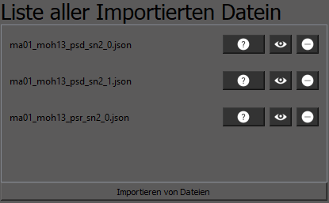
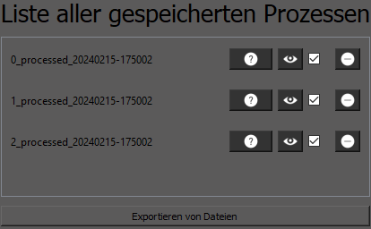
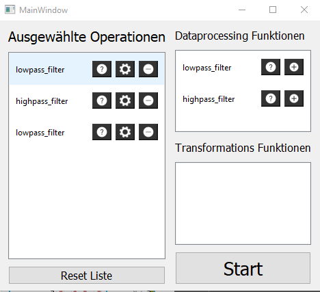
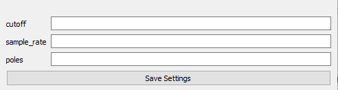

# Funktionenbeschreibung

## Main_Fenster
Die Anwendung lässt sich durch das ausführen der main.py starten

### Hier ist eine Liste an Funktionalitäten des Hauptfensters

- Auf der linken Seite wird beim erstmaligen Starten die möglichkeiten von bokeh angezeigt, welche beim erstmaligen importieren/generieren von Signalen überschrieben wird

- Oben Rechts werden alle importierten Signale in einer Liste angezeigt, welche durch das Klicken des Import-Buttons importiert werden können. Die Signale können ausgeblendet/eingeblendet werden und wieder gelöscht werden, durch das anklicken der Buttons neben dem Namen.
- 
- Unten Rechts werden alle bearbeiteten Signale angezeigt. Durch das anklicken der Checkbox kann diese für den Exportverfahren ausgewählt werden. Beim Klick auf den Export-Button werden alle angecheckten Signale exportiert.
- 
- die Navigation auf der linken Seite funktioniert zwar, aber die anderen beiden Seiten wurden noch nicht implementiert (Zukunft)

## Settings Fenster
Dieses Fenster lässt sich durch das Klicken des "Zahnrad"-Symbols auf der Hauptgui öffnen und beinhaltet alle Einstellungsmöglichkeiten und Auswahlmöglichkeiten von Filter/Transformations - Funktionen.

### Hier ist eine Liste an Funktionalitäten des Settingsfensters

- Auf der rechten Seite sind alle verfügbaren Vorverabeitungsfunktionen aufgelistet, welche durch klicken des Add-Buttons in die Link-Liste eingefügt werden können.
- Eingefügte Funktionen können durch das "Zahnrad"-symbol individuell eingestellt werden ( Momentan müssen die eingegebenen Werte einen Sinn ergeben, da noch keine Fehlermeldung innerhalb der GUI geworfen wird bzw gecatched werden.)
- Alle ausgewählten Operationen können per Drag-and-Drop neu angeordnet werden (Die Reihenfolge der Operationen in der Liste wiederspiegeln die Reihenfolge der Funktionsaufrufe)

## Parameter-settings Fenster
Dieses Fenster ermöglicht es spezifische Parameter den ausgewählten Funktionen zu Übergeben.
Es wird automatisch nach den Parameter-Annotationen der Funktion erstellt.

### Hier ist eine Liste an Funktionalitäten des Parameter-Settingsfensters

- Einstellen der Parameter einer ausgewählten Funktione
- Einstellungen müssen durch das Klicken des "Save Settings"-Buttons abgespeichert werden.

# Zu beachten
- Auf Fehler bei Eingaben wurde noch nicht geachtet. Es können bei falscher Eingabe von Parametern Fehler auftreten die noch nicht gecatched oder gehandeled werden.
- Der "Reset List"-Button im Settings_Fenster funktioniert noch nicht
- Es wird nicht der Name der Funktion in den Parameter_settings angezeigt, momentan nur "TextLabel"
- Alle Dateien die mit "ui" enden, sind automatisch generierte Dateien vom QTDesigner. Diese Dateien müssen mit PySide2 in python dateien umgewandelt werden, weshalb es viele "ui" Dateien mit dem selben Namen wie so manche python-Dateien existieren
- Wenn ein Signal mehrere Achsen aufweist, wird momentan nur die X-Achse genommen

# Zukünftige Funktionen

- Docstrings von Functionen sollen auch in die Parameter_Settings_GUI
zur Hilfe von Parameterinformationen eingefügt werden.
- Die 2 weiteren Seiten im Hauptfenster (Manuelles Schneiden und allgemeine Visualisierung) sind noch nicht implementiert
- die Namen der bearbeiteten Signalen werden momentan nur duch die Zeit "einzigartig" gehalten. Sollte durch einfügen der Parameter und sonstige Einstellmöglichkeiten im Namen zur "Einzigartigkeit" führen.
- Bei der Eingabe von Parametern im Parameter_Settings-Fenster, soll nun auch eine spezifische Parameterbereiche für jede Funktion erstellt werden. Durch die Annotation.
- Alle Fehler sollten "gecatched" und in einer ErrorGUI angezeigt werden mit ausführlciher Fehlermeldung
- Es sollen verschiedene Formate von Dateien importierbar sein.
- Andere Datentypen wie eine Anreihung von Bildern (ToF) hinzufügen

### Projekt erstellt von Luca.Moser

